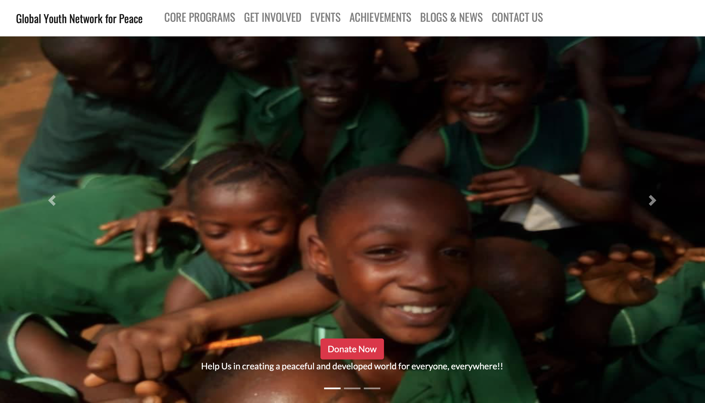
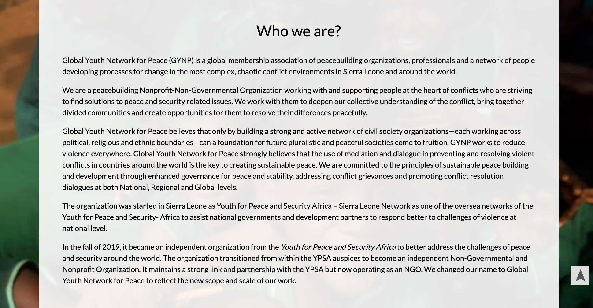
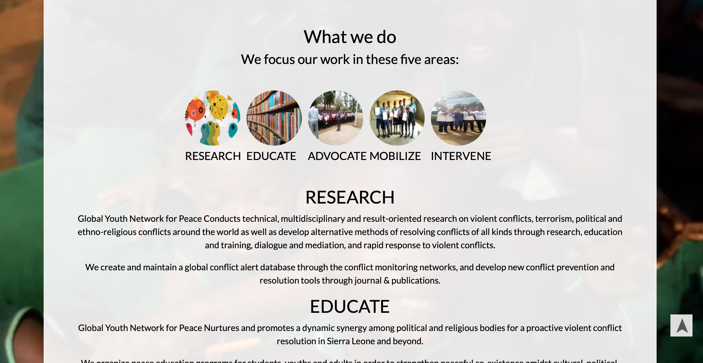
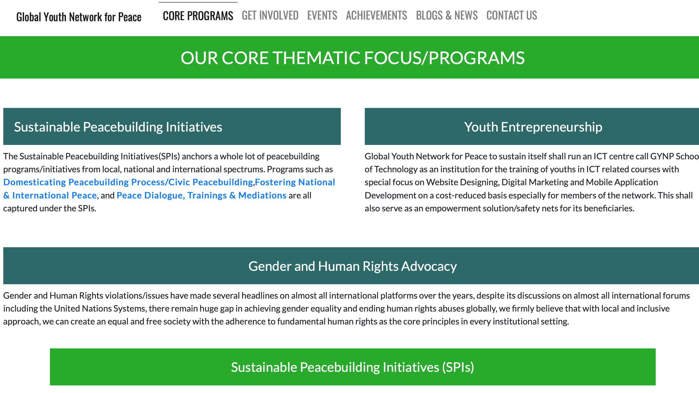
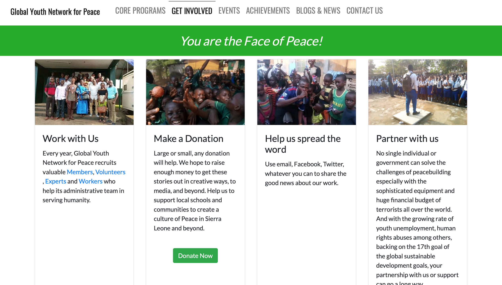
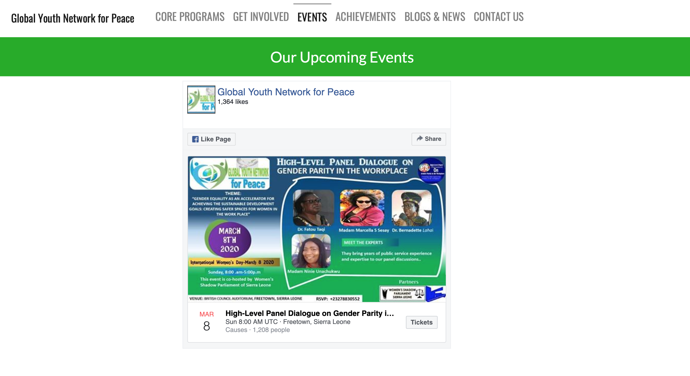
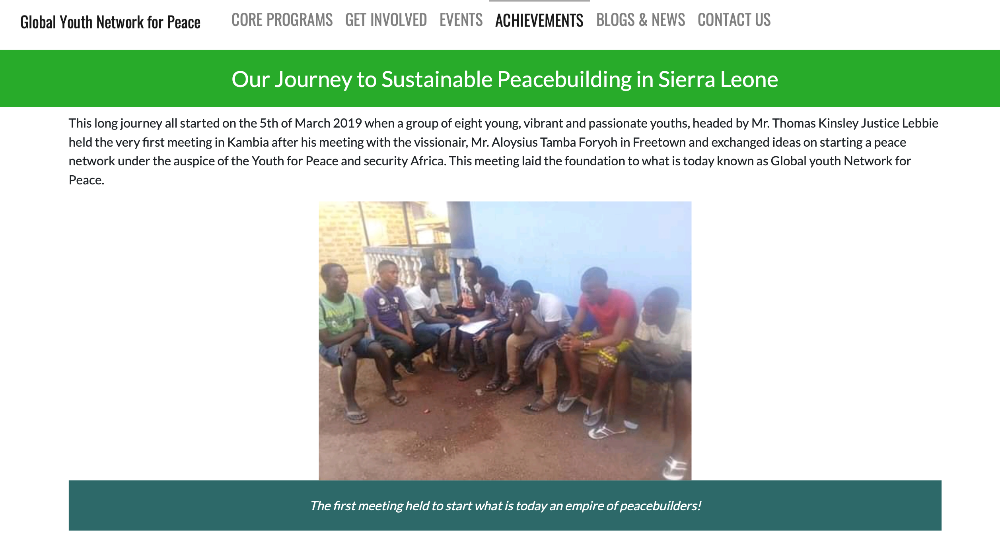
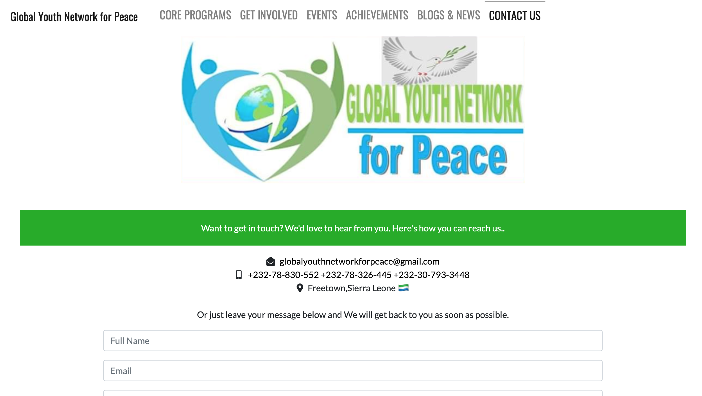

# GYNP(Beta)
The official website for Global Youth Network for Peace (GYNP).
GYNP is a peacebuilding Nonprofit and Non-Governmental Organization working with and supporting people at the heart of conflicts who are striving to find solutions to peace and security related issues. 

<h1 align="center">Global Youth Network for Peace.</h1>
<h3 align="center">🌀By NehaGupta</h3>
This web app is a portfolio site for a charity "Global Youth Network for Peace" based in Sierra Leone. 
This app features a blog page along with other static pages with a working contact form powered by Formspree.

## [Deployed Link](https://maraschino-river.cloudvent.net/)

## Prerequisites
- Familiarity with web development and source control.
- Text editor or IDE preferabbly Sublime or VSCode

## Installation
- Install Jekyll.

## Built With
  - Bootstrap
  - CSS3
  - HTML5
  - ES6
  - JavaScript
  - JSX
  - Jekyll
  
## Structure 
.
├── Gemfile
├── Gemfile.lock
├── README.md
├── _config.yml
├── _layouts
│   └── default.html
├── _posts
│   ├── 2019-01-04-test-post.md
│   └── 2019-01-06-first-post.md
├── _site
│   ├── 2019
│   │   └── 01
│   │       ├── 04
│   │       │   └── test-post.html
│   │       └── 06
│   │           └── first-post.html
│   ├── README.md
│   ├── achieves.html
│   ├── assets
│   │   ├── css
│   │   │   └── style.css
│   │   └── images
│   ├── blog.html
│   ├── contact.html
│   ├── events.html
│   ├── index.html
│   ├── involved.html
│   ├── programs.html
│   ├── script.js
│   ├── siteicon.png
│   └── uploads
├── _uploads
├── achieves.html
├── assets
│   ├── css
│   │   └── style.css
│   └── images
├── blog.html
├── contact.html
├── events.html
├── index.html
├── involved.html
├── programs.html
├── script.js
└── siteicon.png
  
## Screenshots

    

    

    

    

    

    

    

    

## Author
Neha Gupta 

## Suggestions (Please)
- Reach via Issues (GitHub).
- Drop me an email.

## License
This project is licensed under the MIT License - see the LICENSE.md file for details.
Global Youth Network for Peace, Freetown Sierra Leone. All Rights Reserved

## Show your support
Give a ⭐️ if this project helped you!
